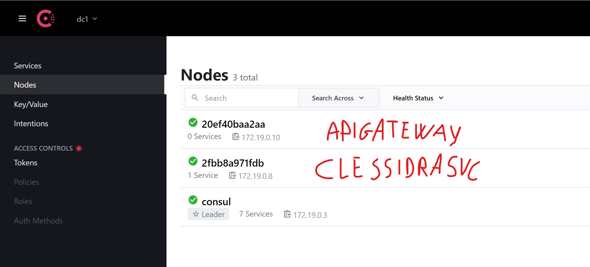

# @deblasis' Space Traffic Control


This is an implementation of the corresponding [Topcoder Challenge](https://www.topcoder.com/challenges/921801de-073c-40d2-8ee2-33f729fd228b?tab=details)


## Overview


### Architecture
The architecture of this implementation is as follows:


There is also a single `Consul` leader instance and two additional `Agents` offering DNS for `APIGateway` and `ShippingStationSvc`.

### Consul

All services report health status via Grpc to Consul, that, along with the design, enables horizontal scaling.
#### Services


#### Nodes


### Gateway

All http requests requests are served by a front facing `API Gateway` that implements *GRPC-Gateway*.
It proxies requests, converts them into GRPC and also takes care of handling authorization headers.

### AuthZ / AuthN
I used JWTs RSA RS256 and I implemented handlers, interceptors and ACL myself instead of using out-of-the-box solutions. 

### TLS
It's implemented but disabled by default to simplify testing/verification/debugging
### Backend
In the backend, the services communicate with each other via GRPC but also expose HTTP endpoints for debugging purposes. Ideally, they should be disabled in a real-world production environment via a feature-flag of some sort.

### Persistence
On the `persistence` side of things, there are specific microservices for the two databases in this implementation.

`CentralCommandDBSvc` has a peculiarity which is a feature-flagged Auxiliary GRPC endpoint that serves the purpose of exposing a method that's used to cleanup the database during integration tests.

## Database
Nothing special, I used views and functions to fulfill the requirements and I leveraged the multi-model features provided by pg-go to have a very very simple CQRS

## Seeding
There's a small binary that seeds the database using a CSV file and a staging table, when the staging table contains record, the AuthDBSvc picks up the records, hashes the passwords and deletes the table. This happens at service start, which implies that a restart has to be triggered, this is by design for security reasons.

In order to seed the database:
```bash
make seed-auth_dbsvc
```
The input file is located [here](./services/auth_dbsvc/scripts/seeding/users.csv)

### Docker
The docker/docker compose setup takes advantage of the various features available such as caching, build images and parallel builds.

I applied layering here too, for example having a `docker-compose.hostports.yml` file used to expose ports in local environment, or a `docker-compose.integrationtests.yml` that configures the databases to be ephemeral and adds the container that executes E2E tests when it spins up.

### Makefile
The makefile is used as a productivity enhancer, there are targets that are meant to be used only in local development, such as `run-fast` that builds the binaries on the host in parallel (way faster especially if using multi-core machines) and then copies them into the respective containers.

### Certificates
They can be generated on the host or inside a container for a containerized build depending on the needs. There's also a target in the Makefile to copy the certificates to the host from the containerized builder for debugging purposes.

### Worker
There's a worker service called `ClessidraSvc` (Clessidra is Italian for hourglass) that simulates passage of time, making sure that the ships that are supposed to leave, leave their docks and that the reserved docks are freed after a configurable timeout


## Prerequisites
1. Docker
1. Docker-Compose
1. Go 1.11+


## Running Tests
```bash
make run-fast-integrationtests
```
Spins up the whole stack and executes E2E tests in a dedicated container with logging enabled at the database level too.

For the same environment but to attach only the the integrationtester run (this is used in CI/CD checks):
```bash
make integrationtests-run
```

## Local Deployment
```bash
make run-fast-integrationtests
```

## Production Build and Installation
To spin up a version that doesn't expose container ports apart from the entrypoint (ApiGateway)
```bash
make run-fast
```
You can then navigate to http://localhost:8081 to the Swagger UI 


## Notes
- I introduced the concept of `reservation` when a ship requests-landing because let's suppose that there's only one dock available, I don't want multiple ships to be offered the same dock.
First come first serve.

- When a ship has to land, in the requirements there's no mention of the `dockId` to land to.
Since when we request landing we receive a `dockId` (from `dockingStation` in the response with `command` = `land`) I made it compulsory to have a `land` request that requires not only the `time` but also the `dockId` to land to.

- I believe this was a fun challenge, I am sorry I didn't see much participation and submissions so far (we are 9d from submission end at the time of writing). 

- Because of the latter reason, I didn't spend too much time cleaning up the code, refactoring, etc. I might do that on Github after the competition is completed.